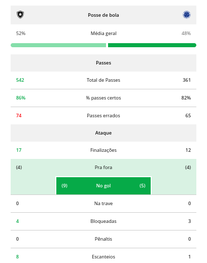
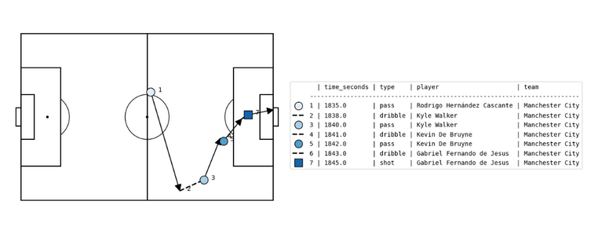

# Uso de ciência de dados aplicada ao esporte

\begin{columns}
\begin{column}{0.5\textwidth}
\centering

\end{column}
\begin{column}{0.5\textwidth}
\centering

\end{column}
\end{columns}

# Dados de súmula no futebol

# Dados de evento

# SPADL

| **Atributo**   | **Descrição**                                                        |
| -------------- | -------------------------------------------------------------------- |
| game_id        | O ID do jogo no qual a ação foi realizada                            |
| period_id      | O ID do período do jogo no qual a ação foi realizada                 |
| seconds        | O tempo de início da ação                                            |
| player         | O jogador que realizou a ação                                        |
| team           | O time do jogador                                                    |
| start_x        | A localização x onde a ação começou                                  |
| start_y        | A localização y onde a ação começou                                  |
| end_x          | A localização x onde a ação terminou                                 |
| end_y          | A localização y onde a ação terminou                                 |
| action_type    | O tipo de ação (por exemplo, passe, chute, drible)                   |
| result         | O resultado da ação (por exemplo, sucesso ou falha)                  |
| bodypart       | A parte do corpo do jogador usada para a ação                        |

**Table 1: Descrição dos dados no formato SPADL**

# Objetivos

## Descoberta de subgrupos

- Trabalho motivador: `Subgroup Discovery in Soccer Data`
- Reproduzir os experimentos do artigo e experimentar com novos algoritmos de SD

## Mineração de sequências

- Trabalho movitador: `Supervised sequential pattern mining of event sequences in sport to identify important patterns of play: An application to rugby union`
- Aplicar as ideias em sequências de jogadas de futebol

# Referencial teórico

## Gols Esperados (xG)

- This is a bullet point.

## VAEP

- ldks

# Descoberta de subgrupos 
 
-res

# Mineração de sequências 

-res

# Conclusion

- Any questions?
